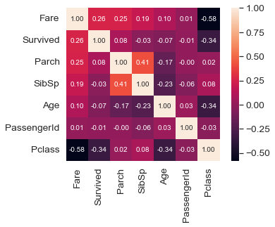

### 数据预处理


```python
import pandas as pd
import numpy as np
import matplotlib.pyplot as plt
import seaborn as sns
```

#### 1. 数据加载与粗略查看
- 数据加载
- 数据粗略查看

##### 1.1 数据加载


```python
# csv文件
df = pd.read_csv('titanic.csv')
# 但有时数据不是简单的csv，它按照文本保存，如“ID||texttexttexttext”这样的一条数据需要将中间的“||”当作分隔符，读取方式如下：
# train = pd.read_csv('../input/training_text', sep="\|\|", engine='python', header=None, skiprows=1, names=["ID","Text"])
# 更多参数应查阅pandas文档
```

##### 1.2 数据粗略查看


```python
df.head(5)     #显示前5行数据
```


<div>
<style scoped>
    .dataframe tbody tr th:only-of-type {
        vertical-align: middle;
    }

    .dataframe tbody tr th {
        vertical-align: top;
    }

    .dataframe thead th {
        text-align: right;
    }
</style>
<table border="1" class="dataframe">
  <thead>
    <tr style="text-align: right;">
      <th></th>
      <th>PassengerId</th>
      <th>Survived</th>
      <th>Pclass</th>
      <th>Name</th>
      <th>Sex</th>
      <th>Age</th>
      <th>SibSp</th>
      <th>Parch</th>
      <th>Ticket</th>
      <th>Fare</th>
      <th>Cabin</th>
      <th>Embarked</th>
    </tr>
  </thead>
  <tbody>
    <tr>
      <th>0</th>
      <td>1</td>
      <td>0</td>
      <td>3</td>
      <td>Braund, Mr. Owen Harris</td>
      <td>male</td>
      <td>22.0</td>
      <td>1</td>
      <td>0</td>
      <td>A/5 21171</td>
      <td>7.2500</td>
      <td>NaN</td>
      <td>S</td>
    </tr>
    <tr>
      <th>1</th>
      <td>2</td>
      <td>1</td>
      <td>1</td>
      <td>Cumings, Mrs. John Bradley (Florence Briggs Th...</td>
      <td>female</td>
      <td>38.0</td>
      <td>1</td>
      <td>0</td>
      <td>PC 17599</td>
      <td>71.2833</td>
      <td>C85</td>
      <td>C</td>
    </tr>
    <tr>
      <th>2</th>
      <td>3</td>
      <td>1</td>
      <td>3</td>
      <td>Heikkinen, Miss. Laina</td>
      <td>female</td>
      <td>26.0</td>
      <td>0</td>
      <td>0</td>
      <td>STON/O2. 3101282</td>
      <td>7.9250</td>
      <td>NaN</td>
      <td>S</td>
    </tr>
    <tr>
      <th>3</th>
      <td>4</td>
      <td>1</td>
      <td>1</td>
      <td>Futrelle, Mrs. Jacques Heath (Lily May Peel)</td>
      <td>female</td>
      <td>35.0</td>
      <td>1</td>
      <td>0</td>
      <td>113803</td>
      <td>53.1000</td>
      <td>C123</td>
      <td>S</td>
    </tr>
    <tr>
      <th>4</th>
      <td>5</td>
      <td>0</td>
      <td>3</td>
      <td>Allen, Mr. William Henry</td>
      <td>male</td>
      <td>35.0</td>
      <td>0</td>
      <td>0</td>
      <td>373450</td>
      <td>8.0500</td>
      <td>NaN</td>
      <td>S</td>
    </tr>
  </tbody>
</table>
</div>


```python
df.tail(5)     #显示后5行数据
```


<div>
<style scoped>
    .dataframe tbody tr th:only-of-type {
        vertical-align: middle;
    }

    .dataframe tbody tr th {
        vertical-align: top;
    }

    .dataframe thead th {
        text-align: right;
    }
</style>
<table border="1" class="dataframe">
  <thead>
    <tr style="text-align: right;">
      <th></th>
      <th>PassengerId</th>
      <th>Survived</th>
      <th>Pclass</th>
      <th>Name</th>
      <th>Sex</th>
      <th>Age</th>
      <th>SibSp</th>
      <th>Parch</th>
      <th>Ticket</th>
      <th>Fare</th>
      <th>Cabin</th>
      <th>Embarked</th>
    </tr>
  </thead>
  <tbody>
    <tr>
      <th>886</th>
      <td>887</td>
      <td>0</td>
      <td>2</td>
      <td>Montvila, Rev. Juozas</td>
      <td>male</td>
      <td>27.0</td>
      <td>0</td>
      <td>0</td>
      <td>211536</td>
      <td>13.00</td>
      <td>NaN</td>
      <td>S</td>
    </tr>
    <tr>
      <th>887</th>
      <td>888</td>
      <td>1</td>
      <td>1</td>
      <td>Graham, Miss. Margaret Edith</td>
      <td>female</td>
      <td>19.0</td>
      <td>0</td>
      <td>0</td>
      <td>112053</td>
      <td>30.00</td>
      <td>B42</td>
      <td>S</td>
    </tr>
    <tr>
      <th>888</th>
      <td>889</td>
      <td>0</td>
      <td>3</td>
      <td>Johnston, Miss. Catherine Helen "Carrie"</td>
      <td>female</td>
      <td>NaN</td>
      <td>1</td>
      <td>2</td>
      <td>W./C. 6607</td>
      <td>23.45</td>
      <td>NaN</td>
      <td>S</td>
    </tr>
    <tr>
      <th>889</th>
      <td>890</td>
      <td>1</td>
      <td>1</td>
      <td>Behr, Mr. Karl Howell</td>
      <td>male</td>
      <td>26.0</td>
      <td>0</td>
      <td>0</td>
      <td>111369</td>
      <td>30.00</td>
      <td>C148</td>
      <td>C</td>
    </tr>
    <tr>
      <th>890</th>
      <td>891</td>
      <td>0</td>
      <td>3</td>
      <td>Dooley, Mr. Patrick</td>
      <td>male</td>
      <td>32.0</td>
      <td>0</td>
      <td>0</td>
      <td>370376</td>
      <td>7.75</td>
      <td>NaN</td>
      <td>Q</td>
    </tr>
  </tbody>
</table>
</div>


```python
df.columns    #查看列名
```


    Index(['PassengerId', 'Survived', 'Pclass', 'Name', 'Sex', 'Age', 'SibSp',
           'Parch', 'Ticket', 'Fare', 'Cabin', 'Embarked'],
          dtype='object')


```python
df.info()     #查看各字段的信息
```

    <class 'pandas.core.frame.DataFrame'>
    RangeIndex: 891 entries, 0 to 890
    Data columns (total 12 columns):
     #   Column       Non-Null Count  Dtype  
    ---  ------       --------------  -----  
     0   PassengerId  891 non-null    int64  
     1   Survived     891 non-null    int64  
     2   Pclass       891 non-null    int64  
     3   Name         891 non-null    object 
     4   Sex          891 non-null    object 
     5   Age          714 non-null    float64
     6   SibSp        891 non-null    int64  
     7   Parch        891 non-null    int64  
     8   Ticket       891 non-null    object 
     9   Fare         891 non-null    float64
     10  Cabin        204 non-null    object 
     11  Embarked     889 non-null    object 
    dtypes: float64(2), int64(5), object(5)
    memory usage: 83.7+ KB


```python
df.shape      #查看数据集行列分布，几行几列
```


    (891, 12)


```python
df.describe() #查看数据的大体情况
```


<div>
<style scoped>
    .dataframe tbody tr th:only-of-type {
        vertical-align: middle;
    }

    .dataframe tbody tr th {
        vertical-align: top;
    }

    .dataframe thead th {
        text-align: right;
    }
</style>
<table border="1" class="dataframe">
  <thead>
    <tr style="text-align: right;">
      <th></th>
      <th>PassengerId</th>
      <th>Survived</th>
      <th>Pclass</th>
      <th>Age</th>
      <th>SibSp</th>
      <th>Parch</th>
      <th>Fare</th>
    </tr>
  </thead>
  <tbody>
    <tr>
      <th>count</th>
      <td>891.000000</td>
      <td>891.000000</td>
      <td>891.000000</td>
      <td>714.000000</td>
      <td>891.000000</td>
      <td>891.000000</td>
      <td>891.000000</td>
    </tr>
    <tr>
      <th>mean</th>
      <td>446.000000</td>
      <td>0.383838</td>
      <td>2.308642</td>
      <td>29.699118</td>
      <td>0.523008</td>
      <td>0.381594</td>
      <td>32.204208</td>
    </tr>
    <tr>
      <th>std</th>
      <td>257.353842</td>
      <td>0.486592</td>
      <td>0.836071</td>
      <td>14.526497</td>
      <td>1.102743</td>
      <td>0.806057</td>
      <td>49.693429</td>
    </tr>
    <tr>
      <th>min</th>
      <td>1.000000</td>
      <td>0.000000</td>
      <td>1.000000</td>
      <td>0.420000</td>
      <td>0.000000</td>
      <td>0.000000</td>
      <td>0.000000</td>
    </tr>
    <tr>
      <th>25%</th>
      <td>223.500000</td>
      <td>0.000000</td>
      <td>2.000000</td>
      <td>20.125000</td>
      <td>0.000000</td>
      <td>0.000000</td>
      <td>7.910400</td>
    </tr>
    <tr>
      <th>50%</th>
      <td>446.000000</td>
      <td>0.000000</td>
      <td>3.000000</td>
      <td>28.000000</td>
      <td>0.000000</td>
      <td>0.000000</td>
      <td>14.454200</td>
    </tr>
    <tr>
      <th>75%</th>
      <td>668.500000</td>
      <td>1.000000</td>
      <td>3.000000</td>
      <td>38.000000</td>
      <td>1.000000</td>
      <td>0.000000</td>
      <td>31.000000</td>
    </tr>
    <tr>
      <th>max</th>
      <td>891.000000</td>
      <td>1.000000</td>
      <td>3.000000</td>
      <td>80.000000</td>
      <td>8.000000</td>
      <td>6.000000</td>
      <td>512.329200</td>
    </tr>
  </tbody>
</table>
</div>


#### 2. 处理丢失的数据
- 处理丢失值
    - 找到丢失位置
    - 处理
        - 填补
        - 忽略
- 处理重复值
- 处理偏离值
    - 查找偏离值
    - 处理
        - 删除
        - 标准化/归一化

##### 2.1 处理丢失值

###### 2.1.1 找到丢失位置


```python
# 输出每个列丢失值也即值为NaN的数据和，并从多到少排序
total = df.isnull().sum().sort_values(ascending=False)
print(total)
```

    Cabin          687
    Age            177
    Embarked         2
    PassengerId      0
    Survived         0
    Pclass           0
    Name             0
    Sex              0
    SibSp            0
    Parch            0
    Ticket           0
    Fare             0
    dtype: int64


```python
# 也可以输出百分比
percent =(df.isnull().sum()/df.isnull().count()).sort_values(ascending=False)
missing_data = pd.concat([total, percent], axis=1, keys=['Total', 'Percent'])
print(missing_data)
```

                 Total   Percent
    Cabin          687  0.771044
    Age            177  0.198653
    Embarked         2  0.002245
    PassengerId      0  0.000000
    Survived         0  0.000000
    Pclass           0  0.000000
    Name             0  0.000000
    Sex              0  0.000000
    SibSp            0  0.000000
    Parch            0  0.000000
    Ticket           0  0.000000
    Fare             0  0.000000


###### 2.1.2 处理-填补


```python
# 使用中位数填补
df['Age'] = df['Age'].fillna(df['Age'].median())
```


```python
# 使用平均数填补
df['Age'] = df['Age'].fillna(df['Age'].mean())
```

###### 2.1.3 处理-忽略


```python
# 去掉一列: 当缺失行数比较多或该特征不重要的时候
df = df.drop(['Cabin'], axis = 1)
```


```python
#去掉这个特征为空的行：当缺失行数比较少的时候
#当然后面可以加上inplace=True表示直接就在内存中替换了不用再赋值个train_new，但是本人多次删除掉几个行，发现有问题时又需要重新建立已经分析好的train，很浪费时间，个人认为还是重新开辟一个比较好
df_new = df.drop(df[df['Embarked'].isnull()].index)
```

##### 2.2 处理重复值


```python
df_new = df_new.drop_duplicates()
```

##### 2.3 处理偏离值

###### 2.3.1 寻找偏离值


```python
#bivariate analysis saleprice/grlivarea
var = 'Age'
data = pd.concat([df['Fare'], df[var]], axis=1)
data.plot.scatter(x=var, y='Fare', xlim=(0,90), ylim=(0,600));
```

    *c* argument looks like a single numeric RGB or RGBA sequence, which should be avoided as value-mapping will have precedence in case its length matches with *x* & *y*.  Please use the *color* keyword-argument or provide a 2D array with a single row if you intend to specify the same RGB or RGBA value for all points.


    

    


##### 2.3.2 处理-删除


```python
df.sort_values(by = 'Fare', ascending = False)[:2]
```


<div>
<style scoped>
    .dataframe tbody tr th:only-of-type {
        vertical-align: middle;
    }

    .dataframe tbody tr th {
        vertical-align: top;
    }

    .dataframe thead th {
        text-align: right;
    }
</style>
<table border="1" class="dataframe">
  <thead>
    <tr style="text-align: right;">
      <th></th>
      <th>PassengerId</th>
      <th>Survived</th>
      <th>Pclass</th>
      <th>Name</th>
      <th>Sex</th>
      <th>Age</th>
      <th>SibSp</th>
      <th>Parch</th>
      <th>Ticket</th>
      <th>Fare</th>
      <th>Embarked</th>
    </tr>
  </thead>
  <tbody>
    <tr>
      <th>258</th>
      <td>259</td>
      <td>1</td>
      <td>1</td>
      <td>Ward, Miss. Anna</td>
      <td>female</td>
      <td>35.0</td>
      <td>0</td>
      <td>0</td>
      <td>PC 17755</td>
      <td>512.3292</td>
      <td>C</td>
    </tr>
    <tr>
      <th>737</th>
      <td>738</td>
      <td>1</td>
      <td>1</td>
      <td>Lesurer, Mr. Gustave J</td>
      <td>male</td>
      <td>35.0</td>
      <td>0</td>
      <td>0</td>
      <td>PC 17755</td>
      <td>512.3292</td>
      <td>C</td>
    </tr>
  </tbody>
</table>
</div>


```python
df = df.drop(df[df['PassengerId'] == 259].index)
df = df.drop(df[df['PassengerId'] == 738].index)
```

###### 2.3.3 处理-保留
当然并不是所有的偏离值都需要删除，具体需要在分析之后选择处理方式。这里将偏离值保留下来并不是原封不动保留，而需要做标准化或归一化处理，具体的处理方式可查看最后一节数据转换、标准化、归一化

#### 3. 数据统计


```python
# 统计某一列中各个元素值出现的次数
df['Pclass'].value_counts()  
```


    3    491
    1    214
    2    184
    Name: Pclass, dtype: int64


```python
# 数据的偏斜度
df['Pclass'].skew()
```


    -0.6369977585999191


```python
# 数据的峰度
df['Pclass'].kurt()
```


    -1.2694374832322646


```python
# 计算两个列的相关度
df['Age'].corr(df['Fare']) 
```


    0.09821633399014416


```python
# 观察两个列的值的二维图
x = 'Age'; y = 'Fare'
data = pd.concat([df[y], df[x]], axis=1)
data.plot.scatter(x=x, y=y, ylim=(0,600));
```

    *c* argument looks like a single numeric RGB or RGBA sequence, which should be avoided as value-mapping will have precedence in case its length matches with *x* & *y*.  Please use the *color* keyword-argument or provide a 2D array with a single row if you intend to specify the same RGB or RGBA value for all points.


    

    


```python
# 计算所有特征值每两个之间的相关系数，并做热力图
corrmat = df.corr() # 得到相关系数
f,ax = plt.subplots(figsize = (12,9))
sns.heatmap(corrmat, vmax = .8, square = True, annot=True, cmap = 'Purples_r') # 热力图
```


    <AxesSubplot:>


    

    


```python
#取出相关性最大的前十个，做出热点图表示
k = 7 #number of variables for heatmap
cols = corrmat.nlargest(k, 'Fare')['Fare'].index
cm = np.corrcoef(df[cols].values.T)
sns.set(font_scale=1.25)
sns.heatmap(cm, cbar=True, annot=True, square=True, fmt='.2f', annot_kws={'size': 10}, yticklabels=cols.values,    xticklabels=cols.values)
```


    <AxesSubplot:>


    

    


#### 4. 特征值的合并、连接
- 分组
- 合并
- 连接

##### 4.1 分组


```python
# 按照船舱等级分组---------------------一个特征值
df.groupby('Pclass',as_index=False)
# 按照船舱等级与船费分组---------------两个特征值
df.groupby(['Pclass','Fare'],as_index=False)
# 船舱等级、船费、年龄-----------------三个特征值
df.groupby(['Pclass','Fare','Age'],as_index=False)
# 跟MSSubClass进行分组，并求分组后的平均值
test = df[['Pclass', 'Fare']].groupby(['Pclass'], as_index=False).mean()
# 选取特定的属性的某个值然后进行分类
df[df['Age']==22].groupby(['Pclass'],as_index=False)
print(test)
```

       Pclass       Fare
    0       1  80.153057
    1       2  20.662183
    2       3  13.675550


##### 4.2 合并


```python
# 获得分组后，统计分组中'end_loc'的数量返回为一列由‘userid’和‘user_count’组成的新的DataFrame
age_count = df.groupby('Pclass',as_index=False)['Age'].agg({'age_count':'count'})
# 将获得的新的DataFrame合并到train，更多的merge参数请查阅文档
new_df = pd.merge(df, age_count, on=['Pclass'], how='left')
print(age_count)
```

       Pclass  age_count
    0       1        214
    1       2        184
    2       3        491


##### 4.3 连接


```python
# 将训练数据与测试数据连接起来，以便一起进行数据清洗。
# 这里需要注意的是，如果没有后面的ignore_index=True，那么index的值在连接后的这个新数据中是不连续的，如果要按照index删除一行数据，可能会发现多删一条。
train = df[:600]
test = df[600:]
merge_data = pd.concat([train, test], ignore_index=True)  

# 另一种合并方式，按列名字进行合并。
all_data = pd.concat((df.loc[:,'Pclass':'Age'], test.loc[:,'Pclass':'Age']))  
all_data.head()
```


<div>
<style scoped>
    .dataframe tbody tr th:only-of-type {
        vertical-align: middle;
    }

    .dataframe tbody tr th {
        vertical-align: top;
    }

    .dataframe thead th {
        text-align: right;
    }
</style>
<table border="1" class="dataframe">
  <thead>
    <tr style="text-align: right;">
      <th></th>
      <th>Pclass</th>
      <th>Name</th>
      <th>Sex</th>
      <th>Age</th>
    </tr>
  </thead>
  <tbody>
    <tr>
      <th>0</th>
      <td>3</td>
      <td>Braund, Mr. Owen Harris</td>
      <td>male</td>
      <td>22.0</td>
    </tr>
    <tr>
      <th>1</th>
      <td>1</td>
      <td>Cumings, Mrs. John Bradley (Florence Briggs Th...</td>
      <td>female</td>
      <td>38.0</td>
    </tr>
    <tr>
      <th>2</th>
      <td>3</td>
      <td>Heikkinen, Miss. Laina</td>
      <td>female</td>
      <td>26.0</td>
    </tr>
    <tr>
      <th>3</th>
      <td>1</td>
      <td>Futrelle, Mrs. Jacques Heath (Lily May Peel)</td>
      <td>female</td>
      <td>35.0</td>
    </tr>
    <tr>
      <th>4</th>
      <td>3</td>
      <td>Allen, Mr. William Henry</td>
      <td>male</td>
      <td>35.0</td>
    </tr>
  </tbody>
</table>
</div>


#### 5. 数据转换、标准化、归一化
- 数据转换
- 标准化
- 归一化

##### 5.1 数据转换


```python
# 浮点型数值转换为整型
df['Age'] = df['Age'].astype(int)
```


```python
# 字符串的替换--映射
df['Sex'] = df['Sex'].map({'female':0,'male':1}).astype(int)
# 一般建议将map拿出来
# sex_mapping = {"female": 0, "male": 1}
# df['Sex'] = df['Sex'].map(sex_mapping)
```


```python
# one-hot独热编码
df = pd.get_dummies(df) 
```


```python
# 将连续型特征值分块，每一块用数字标识
df.loc[ df['Fare'] <= 7.91, 'Fare'] = 0
df.loc[(df['Fare'] > 7.91) & (df['Fare'] <= 14.454), 'Fare'] = 1
df.loc[(df['Fare'] > 14.454) & (df['Fare'] <= 31), 'Fare']   = 2
df.loc[ df['Fare'] > 31, 'Fare'] = 3
df['Fare'] = df['Fare'].astype(int)
```


```python
# df['Age'] = np.log(df['Age'])
# 而有时这样的log不可行，就需要使用log（x+1）来 处理
# 原因：https://blog.csdn.net/liyuanbhu/article/details/8544644
df['Age'] = np.log1p(df['Age'])
```


```python
# 将偏斜度大于0.75的数值列log转换，使之尽量符合正态分布
# numeric_feats = ['Age', 'Fare']
# skewed_feats = df[numeric_feats].apply(lambda x: skew(x.dropna())) #compute skewness
# skewed_feats = skewed_feats[skewed_feats > 0.75]
# skewed_feats = skewed_feats.index
# df[skewed_feats] = np.log1p(df[skewed_feats])
```

##### 5.2 标准化
见**数据预处理-标准化与归一化**

##### 5.3 归一化
见**数据预处理-标准化与归一化**

#### 6. 参考资料
1. [数据预处理](https://blog.csdn.net/u011094454/article/details/77618604)
2. [唐宇迪数据分析](https://study.163.com/course/courseMain.htm?courseId=1003590004&share=1&shareId=1451772796)


```python

```
