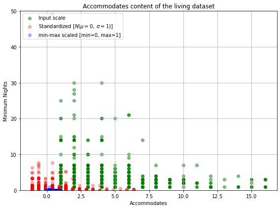

[TOC]

### 【正式】模型-数据科学-数据预处理-标准化与归一化【hxy】

#### 1. 标准化

我们需要对原始数据进行处理，进行Standardization（或者叫Z-score Normalization）

要求：均值$\mu=0$和标准差$\sigma=1$

转换公式如下：
$$
z = \frac{x-\mu}{\sigma}
$$

#### 2. 归一化
另一种方法叫做Min-Max Scaling（或者叫做Normalization，也就是常说的0-1归一化）
处理后的所有特征的值都会被压缩到0到1区间上，这样做还可以抑制离群值对结果的影响


转换公式如下：
$$
X_{norm} = \frac{X - X_{min}}{X_{max}-X_{min}}
$$

#### 3. 案例

##### 3.1 读取数据


```python
import pandas as pd

# 只需要这些features
features = ['accommodates','minimum_nights']
# 读取数据
df = pd.read_csv('listings.csv')[features]

print(df.shape)
df.head()
```

##### 3.2 标准化 & 归一化


```python
from sklearn import preprocessing, impute

# Standardization
std_scale = preprocessing.StandardScaler().fit(df[['accommodates','minimum_nights']])
df_std = std_scale.transform(df[['accommodates','minimum_nights']])

# Normalization
minmax_scale = preprocessing.MinMaxScaler().fit(df[['accommodates','minimum_nights']])
df_minmax = minmax_scale.transform(df[['accommodates','minimum_nights']])
```

##### 3.3 打印标准化后均值和标准差值


```python
print('Mean after standardization:\nAccommodates={:.2f} Minimum Nights={:.2f}'
     .format(df_std[:,0].mean(), df_std[:,1].mean()))
print('\nStandard deviation after standardization:\nAccommodates={:.2f} Minimum Nights={:.2f}'.format(df_std[:,0].std(), df_std[:,1].std()))
```

结果：

    Mean after standardization:
    Accommodates=0.00 Minimum Nights=0.00
    
    Standard deviation after standardization:
    Accommodates=1.00 Minimum Nights=1.00


##### 3.4 画对比图


```python
%matplotlib inline
```


```python
from matplotlib import pyplot as plt

def plot():
    plt.figure(figsize=(8,6))
    
    plt.scatter(df['accommodates'],df['minimum_nights'],color='green',
                label='Input scale',alpha=0.5)
    
    plt.scatter(df_std[:,0], df_std[:,1],color='red',
                label='Standardized [$N (\mu=0, \; \sigma=1)$]',alpha=0.3)
    
    plt.scatter(df_minmax[:,0], df_minmax[:,1], color='blue',
                label='min-max scaled [min=0, max=1]',alpha=0.3)
    
    plt.title('Accommodates content of the living dataset')
    plt.xlabel('Accommodates')
    plt.ylabel('Minimum Nights')
    plt.ylim(0,50)
    plt.legend(loc='upper left')
    plt.grid()
    
    plt.tight_layout()
    
plot()
```



#### 4. 参考资料

1. [唐宇迪数据分析](https://study.163.com/course/courseLearn.htm?courseId=1003590004&share=1&shareId=1451772796#/learn/video?lessonId=1051033552&courseId=1003590004)

2. [数据预处理](https://blog.csdn.net/ck784101777/article/details/107136002)

