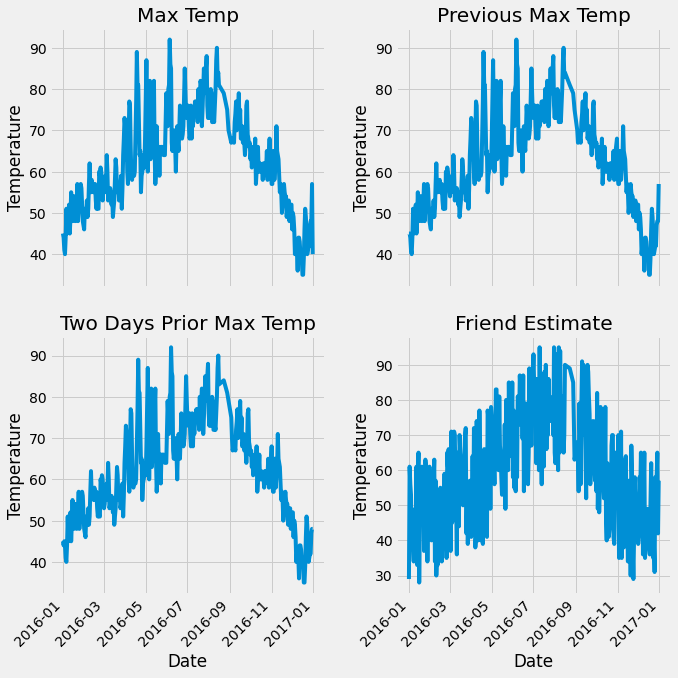
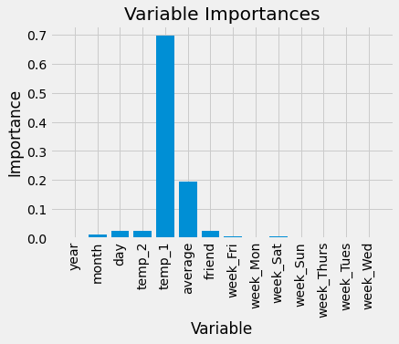

### Random Forest

#### 1. 数据分析
- 数据读取
- 数据大小
- 数据统计指标


```python
# 数据读取
import pandas as pd

features = pd.read_csv('data/temps.csv')
features.head(5)
```

<table border="1" class="dataframe">
  <thead>
    <tr style="text-align: right;">
      <th></th>
      <th>year</th>
      <th>month</th>
      <th>day</th>
      <th>week</th>
      <th>temp_2</th>
      <th>temp_1</th>
      <th>average</th>
      <th>actual</th>
      <th>friend</th>
    </tr>
  </thead>
  <tbody>
    <tr>
      <th>0</th>
      <td>2016</td>
      <td>1</td>
      <td>1</td>
      <td>Fri</td>
      <td>45</td>
      <td>45</td>
      <td>45.6</td>
      <td>45</td>
      <td>29</td>
    </tr>
    <tr>
      <th>1</th>
      <td>2016</td>
      <td>1</td>
      <td>2</td>
      <td>Sat</td>
      <td>44</td>
      <td>45</td>
      <td>45.7</td>
      <td>44</td>
      <td>61</td>
    </tr>
    <tr>
      <th>2</th>
      <td>2016</td>
      <td>1</td>
      <td>3</td>
      <td>Sun</td>
      <td>45</td>
      <td>44</td>
      <td>45.8</td>
      <td>41</td>
      <td>56</td>
    </tr>
    <tr>
      <th>3</th>
      <td>2016</td>
      <td>1</td>
      <td>4</td>
      <td>Mon</td>
      <td>44</td>
      <td>41</td>
      <td>45.9</td>
      <td>40</td>
      <td>53</td>
    </tr>
    <tr>
      <th>4</th>
      <td>2016</td>
      <td>1</td>
      <td>5</td>
      <td>Tues</td>
      <td>41</td>
      <td>40</td>
      <td>46.0</td>
      <td>44</td>
      <td>41</td>
    </tr>
  </tbody>
</table>
数据表中
* year,moth,day,week分别表示的具体的时间
* temp_2：前天的最高温度值
* temp_1：昨天的最高温度值
* average：在历史中，每年这一天的平均最高温度值
* actual：这就是我们的标签值了，当天的真实最高温度
* friend：这一列可能是凑热闹的，你的朋友猜测的可能值，咱们不管它就好了


```python
# 数据大小
print('The shape of our features is:', features.shape)
```

    The shape of our features is: (348, 9)


结果显示：The shape of our features is: (348, 9)，表示我们的数据一共有348条记录，每个样本有9个特征。


```python
# 数据统计指标
features.describe()
```

<table border="1" class="dataframe">
  <thead>
    <tr style="text-align: right;">
      <th></th>
      <th>year</th>
      <th>month</th>
      <th>day</th>
      <th>temp_2</th>
      <th>temp_1</th>
      <th>average</th>
      <th>actual</th>
      <th>friend</th>
    </tr>
  </thead>
  <tbody>
    <tr>
      <th>count</th>
      <td>348.0</td>
      <td>348.000000</td>
      <td>348.000000</td>
      <td>348.000000</td>
      <td>348.000000</td>
      <td>348.000000</td>
      <td>348.000000</td>
      <td>348.000000</td>
    </tr>
    <tr>
      <th>mean</th>
      <td>2016.0</td>
      <td>6.477011</td>
      <td>15.514368</td>
      <td>62.511494</td>
      <td>62.560345</td>
      <td>59.760632</td>
      <td>62.543103</td>
      <td>60.034483</td>
    </tr>
    <tr>
      <th>std</th>
      <td>0.0</td>
      <td>3.498380</td>
      <td>8.772982</td>
      <td>11.813019</td>
      <td>11.767406</td>
      <td>10.527306</td>
      <td>11.794146</td>
      <td>15.626179</td>
    </tr>
    <tr>
      <th>min</th>
      <td>2016.0</td>
      <td>1.000000</td>
      <td>1.000000</td>
      <td>35.000000</td>
      <td>35.000000</td>
      <td>45.100000</td>
      <td>35.000000</td>
      <td>28.000000</td>
    </tr>
    <tr>
      <th>25%</th>
      <td>2016.0</td>
      <td>3.000000</td>
      <td>8.000000</td>
      <td>54.000000</td>
      <td>54.000000</td>
      <td>49.975000</td>
      <td>54.000000</td>
      <td>47.750000</td>
    </tr>
    <tr>
      <th>50%</th>
      <td>2016.0</td>
      <td>6.000000</td>
      <td>15.000000</td>
      <td>62.500000</td>
      <td>62.500000</td>
      <td>58.200000</td>
      <td>62.500000</td>
      <td>60.000000</td>
    </tr>
    <tr>
      <th>75%</th>
      <td>2016.0</td>
      <td>10.000000</td>
      <td>23.000000</td>
      <td>71.000000</td>
      <td>71.000000</td>
      <td>69.025000</td>
      <td>71.000000</td>
      <td>71.000000</td>
    </tr>
    <tr>
      <th>max</th>
      <td>2016.0</td>
      <td>12.000000</td>
      <td>31.000000</td>
      <td>92.000000</td>
      <td>92.000000</td>
      <td>77.400000</td>
      <td>92.000000</td>
      <td>95.000000</td>
    </tr>
  </tbody>
</table>
其中包括了各个列的数量，如果有缺失数据，数量就有所减少，这里因为并不存在缺失值，所以各个列的数量值就都是348了，均值，标准差，最大最小值等指标在这里就都显示出来了。

#### 2. 数据预处理
- 数据格式转换
- 缺失值处理
- 原始数据展示
- 标准化/归一化

时间数据格式转换


```python
# 处理时间数据
import datetime

# 分别得到年，月，日
years = features['year']
months = features['month']
days = features['day']

# datetime格式
dates = [str(int(year)) + '-' + str(int(month)) + '-' + str(int(day)) for year, month, day in zip(years, months, days)]
dates = [datetime.datetime.strptime(date, '%Y-%m-%d') for date in dates]
```


```python
dates[:5]
```


    [datetime.datetime(2016, 1, 1, 0, 0),
     datetime.datetime(2016, 1, 2, 0, 0),
     datetime.datetime(2016, 1, 3, 0, 0),
     datetime.datetime(2016, 1, 4, 0, 0),
     datetime.datetime(2016, 1, 5, 0, 0)]


##### One-Hot Encoding
原始数据：

| week |
|------|
| Mon  |
| Tue  |
| Wed  |
| Thu  |
| Fri  |

编码转换后:

| Mon | Tue | Wed | Thu | Fri |
|-----|-----|-----|-----|-----|
| 1   | 0   | 0   | 0   | 0   |
| 0   | 1   | 0   | 0   | 0   |
| 0   | 0   | 1   | 0   | 0   |
| 0   | 0   | 0   | 1   | 0   |
| 0   | 0   | 0   | 0   | 1   |


```python
# 独热编码
features = pd.get_dummies(features)
features.head(5)
```

<table border="1" class="dataframe">
  <thead>
    <tr style="text-align: right;">
      <th></th>
      <th>year</th>
      <th>month</th>
      <th>day</th>
      <th>temp_2</th>
      <th>temp_1</th>
      <th>average</th>
      <th>actual</th>
      <th>friend</th>
      <th>week_Fri</th>
      <th>week_Mon</th>
      <th>week_Sat</th>
      <th>week_Sun</th>
      <th>week_Thurs</th>
      <th>week_Tues</th>
      <th>week_Wed</th>
    </tr>
  </thead>
  <tbody>
    <tr>
      <th>0</th>
      <td>2016</td>
      <td>1</td>
      <td>1</td>
      <td>45</td>
      <td>45</td>
      <td>45.6</td>
      <td>45</td>
      <td>29</td>
      <td>1</td>
      <td>0</td>
      <td>0</td>
      <td>0</td>
      <td>0</td>
      <td>0</td>
      <td>0</td>
    </tr>
    <tr>
      <th>1</th>
      <td>2016</td>
      <td>1</td>
      <td>2</td>
      <td>44</td>
      <td>45</td>
      <td>45.7</td>
      <td>44</td>
      <td>61</td>
      <td>0</td>
      <td>0</td>
      <td>1</td>
      <td>0</td>
      <td>0</td>
      <td>0</td>
      <td>0</td>
    </tr>
    <tr>
      <th>2</th>
      <td>2016</td>
      <td>1</td>
      <td>3</td>
      <td>45</td>
      <td>44</td>
      <td>45.8</td>
      <td>41</td>
      <td>56</td>
      <td>0</td>
      <td>0</td>
      <td>0</td>
      <td>1</td>
      <td>0</td>
      <td>0</td>
      <td>0</td>
    </tr>
    <tr>
      <th>3</th>
      <td>2016</td>
      <td>1</td>
      <td>4</td>
      <td>44</td>
      <td>41</td>
      <td>45.9</td>
      <td>40</td>
      <td>53</td>
      <td>0</td>
      <td>1</td>
      <td>0</td>
      <td>0</td>
      <td>0</td>
      <td>0</td>
      <td>0</td>
    </tr>
    <tr>
      <th>4</th>
      <td>2016</td>
      <td>1</td>
      <td>5</td>
      <td>41</td>
      <td>40</td>
      <td>46.0</td>
      <td>44</td>
      <td>41</td>
      <td>0</td>
      <td>0</td>
      <td>0</td>
      <td>0</td>
      <td>0</td>
      <td>1</td>
      <td>0</td>
    </tr>
  </tbody>
</table>


```python
# 编码后数据大小
print('Shape of features after one-hot encoding:', features.shape)
```

    Shape of features after one-hot encoding: (348, 15)


原始数据展示


```python
# 准备画图
import matplotlib.pyplot as plt

%matplotlib inline

# 指定默认风格
plt.style.use('fivethirtyeight')

# 设置布局
fig, ((ax1, ax2), (ax3, ax4)) = plt.subplots(nrows=2, ncols=2, figsize = (10,10))
fig.autofmt_xdate(rotation = 45)

# 标签值
ax1.plot(dates, features['actual'])
ax1.set_xlabel(''); ax1.set_ylabel('Temperature'); ax1.set_title('Max Temp')

# 昨天
ax2.plot(dates, features['temp_1'])
ax2.set_xlabel(''); ax2.set_ylabel('Temperature'); ax2.set_title('Previous Max Temp')

# 前天
ax3.plot(dates, features['temp_2'])
ax3.set_xlabel('Date'); ax3.set_ylabel('Temperature'); ax3.set_title('Two Days Prior Max Temp')

# 我的逗逼朋友
ax4.plot(dates, features['friend'])
ax4.set_xlabel('Date'); ax4.set_ylabel('Temperature'); ax4.set_title('Friend Estimate')

plt.tight_layout(pad=2)
```


​    

​    


#### 3. 数据集处理
- 特征/标签划分
- 训练集/测试集划分


```python
## 特征/标签划分
# 数据与标签
import numpy as np

# 标签
labels = np.array(features['actual'])

# 在特征中去掉标签
features= features.drop('actual', axis = 1)

# 名字单独保存一下，以备后患
feature_list = list(features.columns)

# 转换成合适的格式
features = np.array(features) 
```


```python
# 训练集/测试集划分
from sklearn.model_selection import train_test_split

train_features, test_features, train_labels, test_labels = train_test_split(features, labels, test_size = 0.25,
                               random_state = 42)
```


```python
print('训练集特征:', train_features.shape)
print('训练集标签:', train_labels.shape)
print('测试集特征:', test_features.shape)
print('测试集标签:', test_labels.shape)
```

    训练集特征: (261, 14)
    训练集标签: (261,)
    测试集特征: (87, 14)
    测试集标签: (87,)


#### 4. 建立模型

- 导入算法
- 建模
- 训练


```python
# 导入算法
from sklearn.ensemble import RandomForestRegressor

# 建模
rf = RandomForestRegressor(n_estimators= 1000, random_state=42)

# 训练
rf.fit(train_features, train_labels)
```


    RandomForestRegressor(n_estimators=1000, random_state=42)


#### 5. 结果测试

- 预测结果
- 评估
- 可视化展示


```python
## 预测结果
predictions = rf.predict(test_features)
```

MAPE指标：平均绝对百分误差


```python
## 评估
# 计算误差
errors = abs(predictions - test_labels)

# mean absolute percentage error (MAPE)
mape = 100 * (errors / test_labels)

print ('MAPE:',np.mean(mape))
```

    MAPE: 6.011244187972058


得到特征重要性


```python
## 评估
# 得到特征重要性
importances = list(rf.feature_importances_)

# 转换格式
feature_importances = [(feature, round(importance, 2)) for feature, importance in zip(feature_list, importances)]

# 排序
feature_importances = sorted(feature_importances, key = lambda x: x[1], reverse = True)

# 对应进行打印
[print('Variable: {:20} Importance: {}'.format(*pair)) for pair in feature_importances]
```

    Variable: temp_1               Importance: 0.7
    Variable: average              Importance: 0.19
    Variable: day                  Importance: 0.03
    Variable: temp_2               Importance: 0.02
    Variable: friend               Importance: 0.02
    Variable: month                Importance: 0.01
    Variable: year                 Importance: 0.0
    Variable: week_Fri             Importance: 0.0
    Variable: week_Mon             Importance: 0.0
    Variable: week_Sat             Importance: 0.0
    Variable: week_Sun             Importance: 0.0
    Variable: week_Thurs           Importance: 0.0
    Variable: week_Tues            Importance: 0.0
    Variable: week_Wed             Importance: 0.0


    [None,
     None,
     None,
     None,
     None,
     None,
     None,
     None,
     None,
     None,
     None,
     None,
     None,
     None]


```python
## 画特征重要性图
# 转换成list格式
x_values = list(range(len(importances)))

# 绘图
plt.bar(x_values, importances, orientation = 'vertical')

# x轴名字
plt.xticks(x_values, feature_list, rotation='vertical')

# 图名
plt.ylabel('Importance'); plt.xlabel('Variable'); plt.title('Variable Importances'); 
```


​    

​    


用最重要的两个特征进行训练并测试


```python
# 选择最重要的那两个特征来试一试
rf_most_important = RandomForestRegressor(n_estimators= 1000, random_state=42)

# 拿到这俩特征
important_indices = [feature_list.index('temp_1'), feature_list.index('average')]
train_important = train_features[:, important_indices]
test_important = test_features[:, important_indices]

# 重新训练模型
rf_most_important.fit(train_important, train_labels)

# 预测结果
predictions = rf_most_important.predict(test_important)

errors = abs(predictions - test_labels)

# 评估结果

mape = np.mean(100 * (errors / test_labels))

print('mape:', mape)
```

    mape: 6.229055723613811


```python
## 可视化
# 导入所需工具包
from sklearn.tree import export_graphviz
import pydot #pip install pydot

# 拿到其中的一棵树
tree = rf.estimators_[5]

# 导出成dot文件
export_graphviz(tree, out_file = 'tree.dot', feature_names = feature_list, rounded = True, precision = 1)

# 绘图
(graph, ) = pydot.graph_from_dot_file('tree.dot')

# 展示
graph.write_png('tree.png'); 
```


