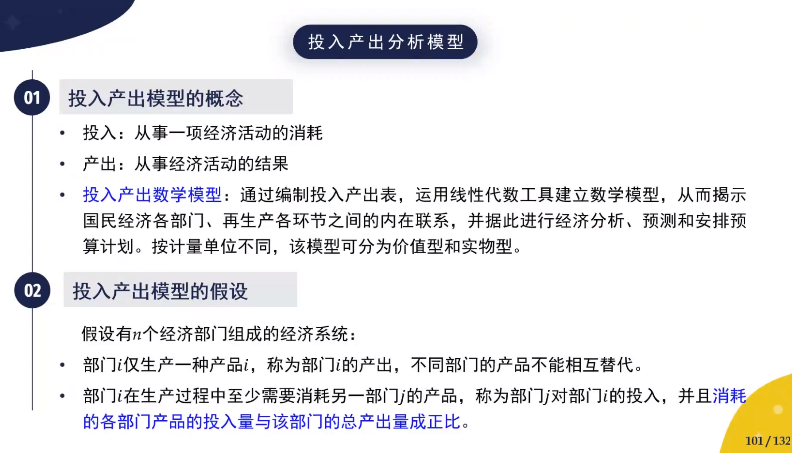
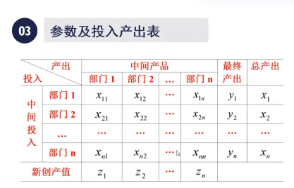
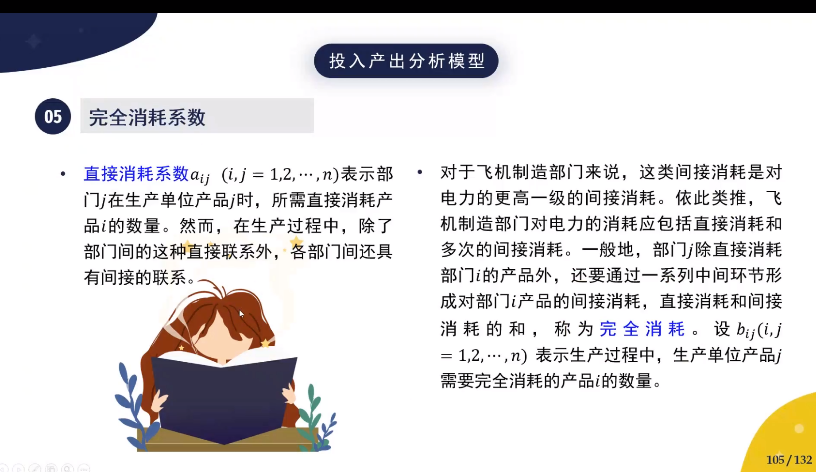

[TOC]

### 模型-经济管理-管理学模型-投入产出分析模型【czy】

### 1. 模型名称

投入产出分析模型 （Input-output Analytical Model）

### 2. 适用范围

研究国民经济各个部门间的平衡，预测国民经济发展的前景

### 3. 概念和假设

### 4. 参数和投入产出表

部门i的总产出————$x_i$$(i=1,2,...,n)$

部门i分配给部门j的产品量————$x_{ij}$   $(i,j=1,2,...,n)$     

 部门j的单位产品对部门i的产品消耗————$a_{ij}$ $(i,j=1,2,...,n)$ 

外部对部门i的需求————$y_i$ $(i=1,2,...,n)$ 

部门j新创造的价值———— $z_j$ $(j=1,2,...,n)$ 

则显然有$x_{ij}=a_{ij}x_j$

### 5. 模型建立

**平衡方程组**

对每一部门，系统内部各部门消耗+外部需求=总产品
$$
\sum_{j=1}^na_{ij}x_j+y_i=x_i(i=1,2,...,n)
$$
对系统内各部门产品的消耗+新创价值=总产值
$$
\sum_{i=1}^na_{ij}x_j+z_j=x_j(j=1,2,...,n)
$$
记
$$
A= \left(
 \begin{matrix}
   a_{11} & a_{12} & \cdots &a_{1n} \\
  a_{21} & a_{22} & \cdots &a_{2n}\\
     \cdots& \cdots &  \cdots & \cdots\\
   a_{n1} & a_{n2} & \cdots &a_{nn}  
  \end{matrix}
  \right)
$$

$$
x= \left(
 \begin{matrix}
   x_1 \\
   x_2\\
  \cdots \\
   x_n
  \end{matrix}
  \right)
$$

$$
y= \left(
 \begin{matrix}
   y_1 \\
   y_2\\
  \cdots \\
   y_n
  \end{matrix}
  \right)
$$

则分配平衡方程组可以写成矩阵形式
$$
x=Ax+y
$$
记

$D=\left[
 \begin{matrix}
   \sum_{i=1}^na_{i1} &  & & \\
   & \sum_{i=1}^na_{i2} &  &\\
     &  &  \cdots & \\
    &&  &\sum_{i=1}^na_{in}  
  \end{matrix}
  \right]$

$z=\left[
 \begin{matrix}
   z_1 \\
   z_2\\
  \cdots \\
   z_n
  \end{matrix}
  \right]$

则消耗平衡方程可以写成矩阵形式

$x=Dx+z$

根据完全消耗的定义，

有$b_{ij}=a_{ij}+\sum_{k=1}^nb_{ik}a_{kj}(i,j=1,2,...,n)$

上式右端第一项直接消耗，第二项为间接消耗，

及矩阵$B=\left(
 \begin{matrix}
   b_{11} & b_{12} & \cdots &b_{1n} \\
  b_{21} & b_{22} & \cdots &b_{2n}\\
     \cdots& \cdots &  \cdots & \cdots\\
   b_{n1} & b_{n2} & \cdots &b_{nn}  
  \end{matrix}
  \right)$

则上式可以写成矩阵形式$B=A+BA$,B为完全消耗矩阵

又由$x=Ax+y$,得$x=(B+E)y$

上式说明，

**如果已知完全消耗系数矩阵B和最终产品向量$y\ge0$，就可以直接计算出总产出向量x**