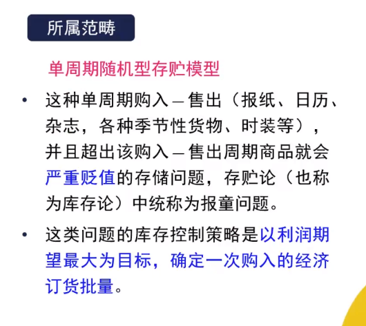
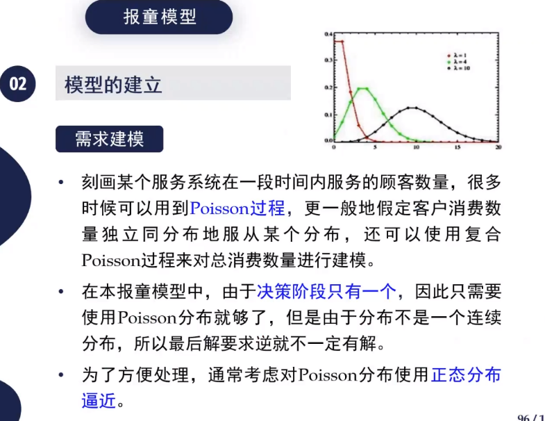

### 模型-经济管理-管理学模型-报童模型【czy】

### 1. 模型名称

报童模型 （NewsVendor Problem,NVP）

### 2. 适用范围

### 3. 符号定义与声明

商家进货量————$x$

当日需求量————$D$         随机变量，服从特定分布，比如poisson和正太分布

D的分布函数和概率密度函数————F，f

脱销单位产品损失————$c_1$

滞销单位产品损失————$c_2$

### 4. 模型求解

#### 4.1 模型目标

进货量$x$时损失为
$$
g(x)=E[c_1(D-x)^++c_2(x-D)^+]
$$
目标是求这个函数的最小值 其中$(x)^+=max(x,0)$

#### 4.2 模型求解

上述期望公式密度函数
$$
g(x)=c_1\int_x^{+\infin}(y-x)f(y)dy+c_2\int_0^{x}(x-y)f(y)dy
$$
然后求两次导数
$$
g'(x)=c_1(F(x)-1)+c_2F(x) \\
g''(x)=(c_1+c_2)f(x)\ge0
$$
表明g是凸函数，从而全局最小值在$g'=0$处取得，进而解得$F(x)=\frac{c_1}{c_1+c_2}$

反解出$x=F^{-1}(\frac{c_1}{c_1+c_2})$