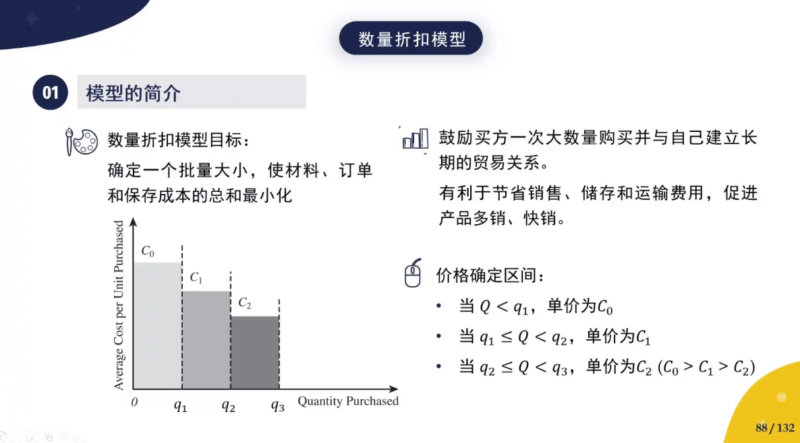
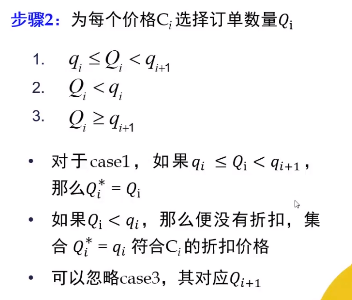

### 模型-经济管理-管理学模型-数量折扣模型【czy】

### 1. 模型名称

数量折扣模型 （Quantity Discount Model）

### 2. 适用范围

考虑数量折扣的EOQ模型

### 3. 模型简介

### 4. 模型步骤

#### 4.1 步骤1

对每个价格$C_i,(0\le i\le r)$的最优批次进行EOQ评估

最优订货量$Q_i=\sqrt{\frac{2DS}{hC_i}}$

#### 4.2 步骤2

#### 4.3 步骤3

计算每一个$Q_i^*$的年度总成本

Total annual cost

$$TC_i=\frac{HQ}{2}+\frac{DS}{Q}+pD$$

#### 4.4 步骤4

选择总成本最低的$Q_i^*$

**分界价格**
$$
C^*=\frac{1}{D}(DC_r+\frac{DS}{q_r}+\frac{h}{2}q_rC_r-\sqrt{2hDSC_r})
$$
高于该价格不存在最优解