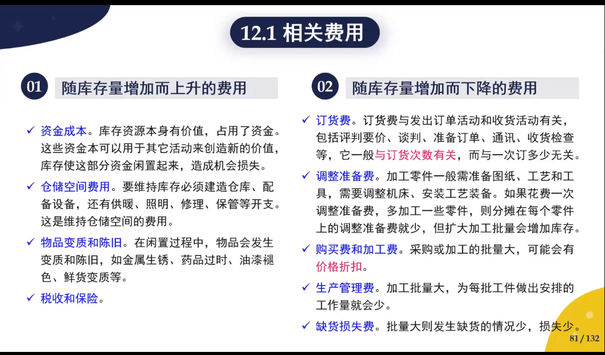
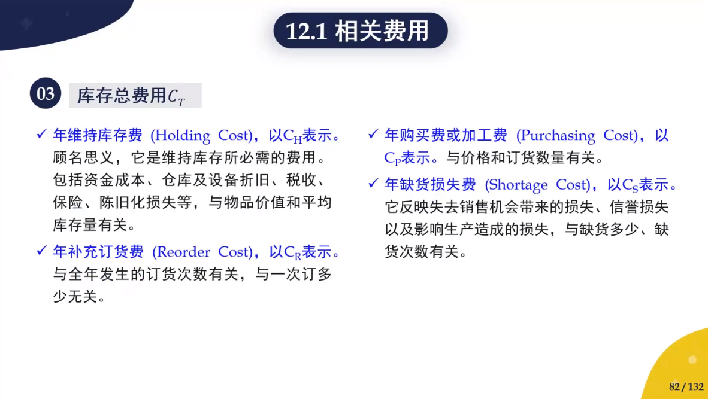
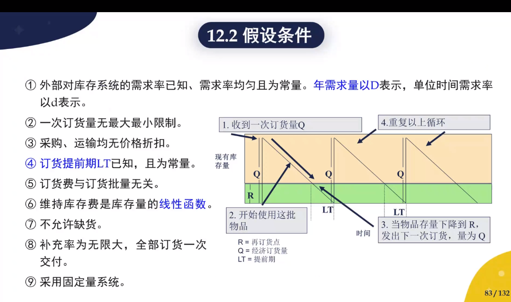
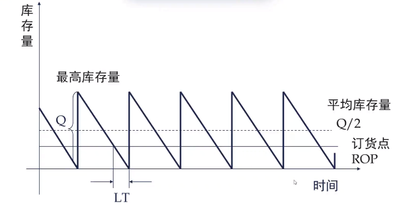

[TOC]

### 模型-经济管理-管理学模型-经济订货批量模型【czy】

### 1. 模型名称

经济订货批量模型 （Economic Order Quantity Model，EOQ model）

### 2. 适用范围

该模型适用于整批间隔进货、**不允许缺货**的存储问题（因为不允许有缺货损失）

### 3. 变量声明和定义

1. 

库存总费用 ————$C_H$

年维持库存费（Holding Cost）————$C_H$

年补充订货费 （Reorder Cost) ————$C_R$

年购买和加工费   (Purchasing Cost)————$C_p$

2. 

再订货点————R

经济订货量————Q

提前期————LT

3. 

一次订货费或调整准备费————$S$

单位维持库存费————$H$,        $H=ph$

单价————$p$

资金效果系数————$h$

年需求量————$D$

### 4. 假设条件

### 5. 模型建立

#### 5.1 模型目标

优化库存的目标就是使$C_T$最小

$C_T=C_H+C_R+C_S=\frac{HQ}{2}+\frac{DS}{Q}+pD$

#### 5.2 模型解法

解出$Q^*$,使得$C_T$最小

最优订货批量
$$
Q^*=\sqrt{\frac{2DS}{H}}
$$

### 6. 参考资料

1. [美赛第十四次培训：经管类模型概览--周建--27/1/2022](https://vshare.sjtu.edu.cn/play/cd8ea54e5f1b42cf7229ef9202c8c9df)

