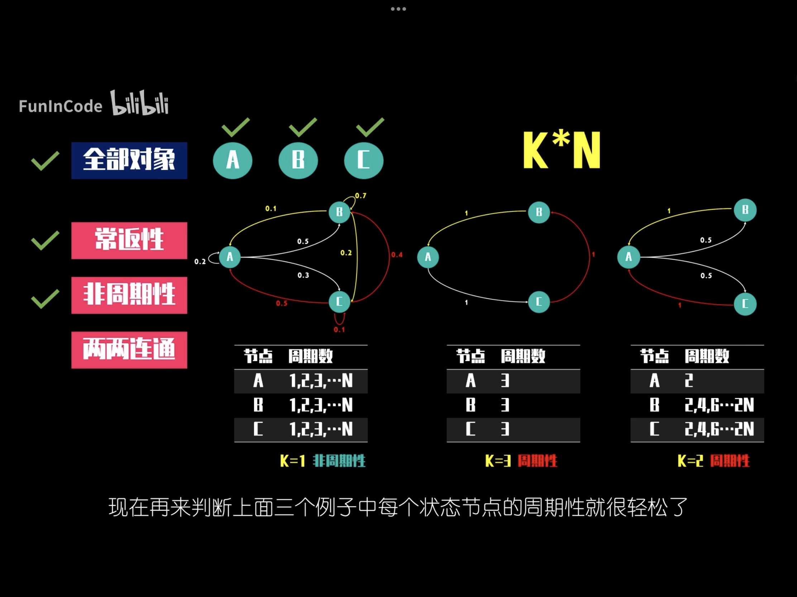
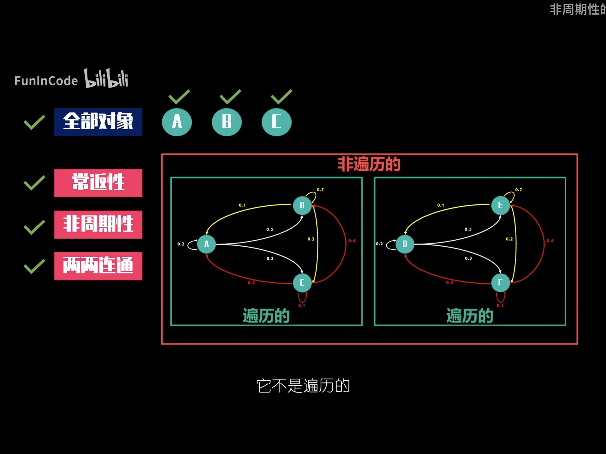

[TOC]

### 模型-预测主题-离散型预测-马尔可夫模型【czy】

#### 1. 模型名称

马尔可夫模型（Markov Model）

#### 2. 适用范围

1. 自然语义处理方面，可以利用字符、词语间的转移矩阵，联想用户接下来想说什么，想搜什么。或随机生成诗词文章

2. 金融行业，可用于分析牛市熊市的状态转换，股票价格预测，信用评级。
3. 如果稳态分布唯一，那么针对稳态分布所展现出的性质，如人们喜怒哀乐的情绪分布，产品选择的偏好，金融产品的违约比率，决策者就可以通过制定更有效的策略去影响并改变稳态分布，让其更适合自身利益需求

#### 3. 马尔可夫链核心三要素

1. **状态空间 states space**

   例一中A,B

2. **无记忆性 Memorylessness**

   当期选择的概率只受上期选择的影响

3. **转移矩阵 transition matrix**

   如例一中

   |           | A(前日） | B(前日） |
   | --------- | -------- | -------- |
   | A（当日） | 0.4      | 0.5      |
   | B（当日） | 0.6      | 0.5      |

#### 4.  马尔可夫链具有唯一的稳态分布的条件

若马尔可夫链的全部状态节点满足这三大条件：**常返性，非周期性，两两连通**，那么马尔可夫链符合遍历性的要求，具有唯一的稳态分布。

##### 4.1 常返性 recurrent

它的对立面是暂时性 transient

B可以进入新状态A/C，但A/C没有返回B的路径，那么称B是暂时性的，非常返

而A或C，它们可以进入新状态C或A，并存在路径返回，则A和C常返

##### 4.2 非周期性 Aperiodic

马尔可夫链中某一状态节点可以经过K*N个周期返回原点,N为大于0的整数，如果K大于等于2，那么我们可以称该状态满足周期性

##### 4.3 连通性

如果A能通过相应路径到达B，B也能通过相应路径到达A，称A/B是连通的

#### 4. 稳态分布求解方法

##### 4.1 Excel---Solver求解器

假如存在并已达到稳态，那么$M\times X=X$,即$(M-I)\times X=0$

所以就是求稳态$X$

#### 5. 实例

##### 5.1 例一

1. **问题描述**

   小明楼下两家早餐铺子A和B，当小明今天选A，下一日40%选A，60%选B。而当小明今天选B，下一日50%选A,50%选B。

2. **状态概率分布推演**和**稳态分布 steady state distribution**

假设第一天小明选择A，那么第一天状态概率分布为$[1,0]^T$,将其与转移矩阵相乘，
$$
\left[
\matrix{
  0.4 & 0.5\\

  0.6 & 0.5
}
\right]\times \left[
\matrix{
  1\\
  
  0 
}
\right]
$$
得到第二天状态概率分布为$[0.4,0.6]^T$

不断重复，继续推演，能达到稳态分布$[0.454545,0.545454]^T$

3. **分析**

初始状态分布非负，相加和为1，得到的稳态分布相同，说明该马尔科夫链下，最终的稳态不受初始状态影响。

但是不是所有的马尔科夫链都具有唯一的稳态分布

##### 5.2 例二

见excel文件《Excel--Solver求解器--马尔可夫链》

#### 4. 参考资料

1.  [B站---数之道---马尔可夫链]()

